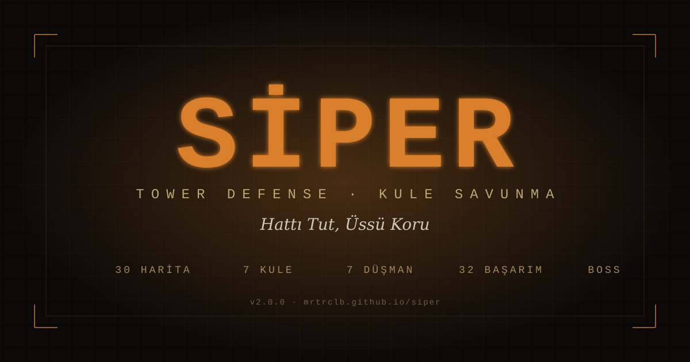

# Siper — Modern Tower Defense

**🌐 Languages:** [English](#english) · [Türkçe](#türkçe)

---

<a name="english"></a>

## English

A browser-based tower defense game with a modern military theme, built as a single-file HTML app with a dark khaki/orange palette. Built from scratch with AI-assisted "vibe coding" — no frameworks, no build step, just one HTML file and a service worker.

**Play now:** [mrtrclb.github.io/siper](https://mrtrclb.github.io/siper/)



### Features

- **30 unique maps** — 15 single-path, 15 multi-path, including 6 **four-way quad-attack** maps where enemies converge on a central HQ from four directions
- **7 tower types** across 3 upgrade levels — Machine Gun, Rocket Launcher, Tank Cannon, Anti-Air SAM, Sniper (instant beam), Flamethrower (cone AoE), Slow Field (frost debuff)
- **7 enemy types** with distinct strategies — Infantry, Armor, Air, Scout (fast), Shielded (shield HP), Regenerator (heals), Mega-Tank (boss)
- **Boss wave system** — A Mega-Tank boss spawns every 10th wave (10/20/30/40/50...) with its own epic health bar banner
- **Tower relocation** — Click any placed tower and use the "Move" button to reposition it once (single-use per tower, free of charge)
- **Hamburger menu UI** — Clean HUD with compact controls: stats + Start Wave + Speed (1×/2×/3×) + hamburger dropdown for all other actions
- **3 difficulty levels** — Easy (250₺ / 30 lives / 1.15× HP), Medium (200 / 20 / 1.22×), Hard (130 / 15 / 1.30× + more air/armor)
- **32-achievement system** — Progression, kill counts, economy milestones, difficulty mastery, boss hunting, special challenges
- **Game speed control** — Toggle between 1×, 2×, 3× for fast-forwarding through long runs
- **Endless wave mode** — Survive as many waves as possible, per-map best-score tracking
- **Full save/load** — Local save per map, with cloud sync via **SI-XXXXXX codes** (Firebase-backed) for cross-device continuation
- **Bilingual TR/EN** — Complete interface and content translation throughout
- **PWA / offline-capable** — Install to home screen, play without internet after first load
- **Live atmosphere** — Drifting ambient particles, passing aircraft silhouettes, procedural Web Audio SFX (no mp3 shots needed)
- **Presence counter** — See how many players are online right now (Firebase RTDB)

### Tower Roster

| Tower | Role | Range | Fire Rate | Damage | Special |
|---|---|---|---|---|---|
| **Machine Gun** | Anti-infantry | 2.3–2.9 | Fast (0.18–0.11s) | Low (6–16) | Piercing at L3 |
| **Rocket Launcher** | Group damage | 2.8–3.4 | Slow (1.2–0.85s) | High (30–95) | Splash AoE |
| **Tank Cannon** | Armor-piercing | 3.0–3.6 | Slow (1.1–0.8s) | Very High (55–220) | High piercing |
| **Anti-Air (SAM)** | Air-only | 3.5–4.3 | Medium (0.55–0.35s) | High (28–90) | Air targets only |
| **Sniper** | Elite single-target | 5.0–6.0 | Slow (1.8–1.4s) | Very High (80–320) | Instant-hit beam, 0.8–1.0 piercing |
| **Flamethrower** | Short-range DoT | 1.6–2.0 | Very Fast (0.08–0.06s) | Very Low (4–11) | Cone AoE, ground only |
| **Slow Field** | Utility / debuff | 2.5–3.1 | Medium (0.5–0.4s) | Very Low (3–8) | Slows enemies 45–65% for 1.5–2.5s |

### Enemy Roster

| Enemy | HP | Speed | Armor | Reward | Special |
|---|---|---|---|---|---|
| **Infantry** | 30 | 1.2× | 0.0 | 6 | Standard unit |
| **Armor** | 110 | 0.7× | 0.55 | 14 | Heavy armor, -3 lives at base |
| **Air** | 55 | 1.6× | 0.1 | 12 | Flying — SAM or Sniper only |
| **Scout** | 22 | 2.6× | 0.0 | 5 | Very fast — bypasses slow towers |
| **Shielded** | 50 + **80 shield** | 0.9× | 0.25 | 22 | Shield absorbs full damage until broken |
| **Regenerator** | 80 | 0.95× | 0.15 | 20 | Regenerates 3 HP/second — need sustained DPS |
| **Mega-Tank (Boss)** | 2200 | 0.35× | 0.75 | 250 | Spawns every 10 waves. -10 lives if reaches base |

#### Enemy Strategy Tips

- **Scouts** outrun slow-firing towers (Rocket, Sniper). Counter with Machine Gun + Slow Field.
- **Shielded** units have a visible blue shield ring — break shield before body damage applies. High-burst towers (Rocket, Sniper) are efficient.
- **Regenerators** glow green when healing. You need high DPS (Machine Gun, Flamethrower) to outpace regen.
- **Bosses** on waves 10/20/30+ have massive HP and 75% armor. Piercing towers (Tank, Sniper) are essential. Stack high-damage + slow for best results.

### Maps

**Single-path (15):** Alpha, Bravo, Charlie, Delta, Echo, India, Kilo, Mike, Oscar, Quebec, Romeo, Yankee, Bravo-II, Delta-II, Charlie-II

**Multi-path (15):** Foxtrot, Golf, Hotel, Juliet, Lima, November, Papa, Zulu, Alpha-II, plus 6 quad-attack maps

**Quad-attack (4-way assault) maps:** Sierra, Tango, Uniform, Victor, Whiskey, X-ray — all feature a central HQ with enemies spawning simultaneously from four directions via round-robin distribution (70% round-robin, 30% random jitter).

### Controls

- **Click / tap** a tower in the sidebar to select — a toast confirms your selection
- **Click on grid** to place the selected tower on a valid empty cell
- **Click** a placed tower to open its panel — Upgrade / Move / Sell
- **Move** button lets you reposition a tower once per tower (free)
- **ESC** to cancel placement, cancel move, or close tower panel
- **X button** to close tower panel
- **Speed button (1×/2×/3×)** in HUD to fast-forward gameplay
- **Hamburger (≡) menu** contains: Pause / Save & Quit / Menu / Restart / Language toggle

### Tech Stack

- **Vanilla HTML + CSS + JavaScript** — single-file, ~5800 lines total
- **Canvas 2D** for rendering (grid, towers, enemies, projectiles, ambient effects, boss banner)
- **Web Audio API** for procedural SFX — no audio files required for game sounds
- **Firebase Realtime Database** for presence, feedback, cloud saves/scores
- **Service Worker** for PWA offline support
- **localStorage** for local saves, best scores, settings, achievement progress
- **No build step** — just open index.html in a browser, or deploy as static files

### Local Development

```bash
git clone https://github.com/mrtrclb/siper.git
cd siper
# No build step. Just serve the folder:
python3 -m http.server 8000
# or: npx serve
```

Open `http://localhost:8000` in your browser.

**Firebase configuration** is hardcoded in `index.html` at the top of the script block. To use your own Firebase project:
1. Create a Realtime Database in europe-west1 (or your region)
2. Paste rules from `firebase-rules.json` into Rules tab
3. Replace the `firebaseConfig` object with your own credentials

### Deployment

This repo deploys to GitHub Pages from the `main` branch. Any push to `main` triggers a rebuild. Service worker version is bumped per release to invalidate old caches.

### Version

Current: **v2.0.0**

See in-game About page for full changelog.

### License

MIT — see [LICENSE](LICENSE)

### Author

**mrtrclb** — hobbyist game developer building browser games with AI-assisted "vibe coding"

Other games:
- [Watch Empire](https://watchempire.net) — Build a watchmaking empire
- [Trade Game](https://tradegame.net) — Stock market and investment simulator

---

<a name="türkçe"></a>

## Türkçe

Modern askeri temalı, tarayıcıda çalışan bir kule savunma oyunu. Tek bir HTML dosyası olarak geliştirildi — koyu haki/turuncu paletle, framework'süz, build adımı olmadan, AI-destekli "vibe coding" yöntemiyle sıfırdan kodlandı.

**Şimdi oyna:** [mrtrclb.github.io/siper](https://mrtrclb.github.io/siper/)

### Özellikler

- **30 benzersiz harita** — 15 tek yollu, 15 çoklu yollu, bunların 6 tanesi **dört yönlü saldırı** haritası (düşmanlar dört bir yönden merkez HQ'ya akın ediyor)
- **7 kule tipi** ve 3 seviye yükseltme — Makineli Tüfek, Roketatar, Tank Topu, Hava Savunma (SAM), Keskin Nişancı (anlık ışın), Alev Makinesi (koni AoE), Yavaşlatıcı (frost debuff)
- **7 düşman tipi** farklı stratejilerle — Piyade, Zırhlı, Hava, Koşucu (hızlı), Kalkanlı (shield HP), Yenileyici (kendini iyileştirir), Mega-Tank (boss)
- **Boss dalga sistemi** — Her 10. dalgada (10/20/30/40/50...) bir Mega-Tank bossu, kendine özel epic can çubuğu ile
- **Kule taşıma** — Yerleştirilmiş bir kuleye tıkla ve "Taşı" butonunu kullan (kule başına tek kullanım, ücretsiz)
- **Hamburger menü arayüzü** — Temiz HUD: istatistikler + Dalgayı Başlat + Hız (1×/2×/3×) + hamburger dropdown (diğer tüm aksiyonlar)
- **3 zorluk seviyesi** — Kolay (250₺ / 30 can / 1.15× HP), Orta (200 / 20 / 1.22×), Zor (130 / 15 / 1.30× + daha fazla hava/zırhlı)
- **32 başarım sistemi** — Dalga ilerleme, kill sayıları, ekonomi, zorluk ustalığı, boss avcılığı, özel meydan okumalar
- **Oyun hızı kontrolü** — 1×, 2×, 3× arası geçiş (uzun oyunları hızlandırmak için)
- **Sonsuz dalga modu** — Mümkün olduğunca çok dalgadan sağ çık, harita bazlı en iyi skor takibi
- **Tam kayıt/yükleme** — Harita başına yerel kayıt + **SI-XXXXXX kodları** ile bulut senkron (Firebase destekli), cihazlar arası devam
- **TR/EN çift dil** — Tüm arayüz ve içerik baştan sona çeviri
- **PWA / çevrimdışı** — Ana ekrana kurulabilir, ilk yüklemeden sonra internet olmadan çalışır
- **Canlı atmosfer** — Süzülen partiküller, geçen uçak silüetleri, prosedürel Web Audio ses efektleri (mp3 gerekmez)
- **Çevrimiçi sayacı** — Şu an kaç kişinin oynadığını gör (Firebase RTDB)

### Kuleler

| Kule | Rolü | Menzil | Ateş Hızı | Hasar | Özel |
|---|---|---|---|---|---|
| **Makineli Tüfek** | Piyade karşıtı | 2.3–2.9 | Hızlı (0.18–0.11s) | Düşük (6–16) | L3'te piercing |
| **Roketatar** | Grup hasarı | 2.8–3.4 | Yavaş (1.2–0.85s) | Yüksek (30–95) | Splash AoE |
| **Tank Topu** | Zırh delici | 3.0–3.6 | Yavaş (1.1–0.8s) | Çok Yüksek (55–220) | Yüksek piercing |
| **Hava Savunma (SAM)** | Sadece hava | 3.5–4.3 | Orta (0.55–0.35s) | Yüksek (28–90) | Sadece hava hedefi |
| **Keskin Nişancı** | Elit tek hedef | 5.0–6.0 | Yavaş (1.8–1.4s) | Çok Yüksek (80–320) | Anlık ışın, 0.8–1.0 piercing |
| **Alev Makinesi** | Kısa menzil DoT | 1.6–2.0 | Çok Hızlı (0.08–0.06s) | Çok Düşük (4–11) | Koni AoE, sadece kara |
| **Yavaşlatıcı** | Destek / debuff | 2.5–3.1 | Orta (0.5–0.4s) | Çok Düşük (3–8) | Düşmanları 1.5–2.5s boyunca %45–65 yavaşlatır |

### Düşmanlar

| Düşman | HP | Hız | Zırh | Ödül | Özel |
|---|---|---|---|---|---|
| **Piyade** | 30 | 1.2× | 0.0 | 6 | Standart birim |
| **Zırhlı** | 110 | 0.7× | 0.55 | 14 | Ağır zırh, üsse -3 can |
| **Hava** | 55 | 1.6× | 0.1 | 12 | Uçan — sadece SAM veya Sniper |
| **Koşucu** | 22 | 2.6× | 0.0 | 5 | Çok hızlı — yavaş kuleleri geçer |
| **Kalkanlı** | 50 + **80 kalkan** | 0.9× | 0.25 | 22 | Kalkan kırılana kadar tüm hasarı soğurur |
| **Yenileyici** | 80 | 0.95× | 0.15 | 20 | Saniyede 3 HP yeniler — sürekli DPS gerekir |
| **Mega-Tank (Boss)** | 2200 | 0.35× | 0.75 | 250 | Her 10 dalgada. Üsse ulaşırsa -10 can |

#### Düşman Stratejisi İpuçları

- **Koşucular** yavaş ateş eden kuleleri (Roketatar, Sniper) geçer. Makineli + Yavaşlatıcı ile karşıla.
- **Kalkanlılar** mavi halka ile görünür — önce kalkanı kırman lazım. Roket, Sniper gibi yüksek-burst kuleler verimli.
- **Yenileyiciler** iyileşirken yeşil parlar. Regen hızını aşmak için yüksek DPS gerekir (Makineli, Alev Makinesi).
- **Bosslar** wave 10/20/30+'da gelir, çok yüksek HP ve %75 zırh. Piercing kuleleri (Tank, Sniper) şart. Yüksek hasar + yavaşlatma kombini en iyisi.

### Haritalar

**Tek yollu (15):** Alfa, Bravo, Charlie, Delta, Echo, India, Kilo, Mike, Oscar, Quebec, Romeo, Yankee, Bravo-II, Delta-II, Charlie-II

**Çoklu yollu (15):** Foxtrot, Golf, Hotel, Juliet, Lima, November, Papa, Zulu, Alfa-II ve 6 dört-yönlü harita

**Dört-yönlü (4-way assault) haritalar:** Sierra, Tango, Uniform, Victor, Whiskey, X-ray — hepsi merkezi bir HQ'ya sahip, düşmanlar dört yönden aynı anda spawn ediyor. Dağıtım round-robin ile dengeli (%70 sıralı, %30 rastgele).

### Kontroller

- **Kuleyi seç**: Yan paneldeki kuleyi tıkla — seçim toast ile onaylanır
- **Yerleştir**: Grid'de boş uygun bir hücreye tıkla
- **Kule paneli**: Yerleştirilmiş kuleye tıkla — Yükselt / Taşı / Sat
- **Taşı** butonu: Her kuleyi bir kez yeniden konumlandır (ücretsiz)
- **ESC**: Yerleştirmeyi iptal, taşımayı iptal, veya kule panelini kapat
- **X butonu**: Kule panelini kapat
- **Hız butonu (1×/2×/3×)**: HUD'da, oyun hızını değiştir
- **Hamburger (≡) menü**: Duraklat / Kaydet & Çık / Menü / Yeniden Başla / Dil değiştir

### Teknoloji

- **Vanilla HTML + CSS + JavaScript** — Tek dosya, yaklaşık 5800 satır
- **Canvas 2D** — Grid, kuleler, düşmanlar, mermiler, atmosfer, boss banner render'ları
- **Web Audio API** — Prosedürel ses efektleri, mp3 gerekmez
- **Firebase Realtime Database** — Presence, feedback, bulut kayıt/skor
- **Service Worker** — PWA çevrimdışı desteği
- **localStorage** — Yerel kayıtlar, en iyi skorlar, ayarlar, başarım ilerlemesi
- **Build adımı yok** — Tarayıcıda index.html aç veya statik dosya olarak deploy et

### Yerel Geliştirme

```bash
git clone https://github.com/mrtrclb/siper.git
cd siper
# Build adımı yok. Klasörü serve et:
python3 -m http.server 8000
# veya: npx serve
```

Tarayıcıda `http://localhost:8000` aç.

**Firebase yapılandırması** `index.html`'in üst kısmındaki script bloğunda hardcoded. Kendi Firebase projeni kullanmak için:
1. europe-west1 (veya kendi bölgende) bir Realtime Database oluştur
2. `firebase-rules.json` içindeki kuralları Rules sekmesine yapıştır
3. `firebaseConfig` objesini kendi bilgilerinle değiştir

### Deploy

Bu repo GitHub Pages'e `main` branch'ten deploy ediyor. `main`'e her push'ta yeniden build oluyor. Her sürümde service worker versiyonu artırılıyor ki eski cache'ler temizlensin.

### Sürüm

Mevcut: **v2.0.0**

Tam changelog için oyun içindeki "Oyun Hakkında" sayfasına bak.

### Lisans

MIT — [LICENSE](LICENSE) dosyasına bak

### Geliştirici

**mrtrclb** — AI-destekli "vibe coding" ile tarayıcı oyunları geliştiren hobicı

Diğer oyunlar:
- [Watch Empire](https://watchempire.net) — Saat üretim imparatorluğu kur
- [Trade Game](https://tradegame.net) — Borsa ve yatırım simülasyonu

---

*Hattı tut, üssü koru.* — Hold the line, protect the base.
